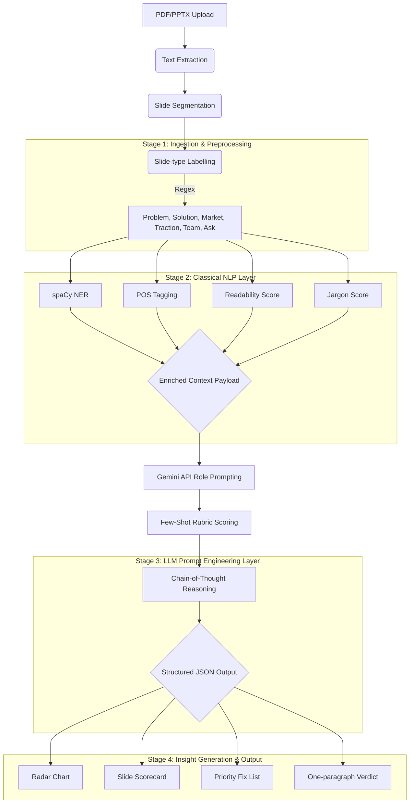

# Startup Pitch Deck Evaluator - Project Plan

## Project Overview
This project builds an automated, robust AI pipeline to evaluate startup pitch decks. By combining classical NLP (spaCy/NLTK) with advanced prompt engineering using the Gemini API, this tool analyzes pitch decks across six critical venture capital dimensions (Problem, Solution, Market, Traction, Team, Ask) and provides structured, explainable scoring and actionable feedback.

---

## System Architecture



---

## Phased Implementation Plan

### Phase 1: Project Setup & Infrastructure
- Initialize a Python virtual environment and structured repository.
- **Dependencies**: `pdfplumber`, `python-pptx`, `spacy`, `nltk`, `textstat`, `google-generativeai` (for Gemini), `pandas`, `matplotlib`/`plotly` (for charts).
- Set up secure environment variable handling for the Gemini API key.

### Phase 2: Dataset Preparation Strategy
- **Data Collection**: Gather 50-80 public pitch decks (e.g., YC Demo Day decks, Sequoia templates) in PDF/PPTX formats.
- **Ground Truth Sourcing**: Extract startup descriptions, funding amounts, and founding dates from Crunchbase/AngelList to validate NER extraction.
- **Manual Annotation**: Create a subset of 20 decks to manually score on the 6-dimension rubric. This serves as human ground truth for LLM evaluation.

### Phase 3: Stage 1 - Ingestion & Preprocessing
- **Text Extraction**: Build modules utilizing `pdfplumber` (for PDFs) and `python-pptx` (for PPTXs) to extract raw text mapped to slide numbers.
- **Slide Classification**: Implement regex-based labeling to auto-categorize each slide (Problem, Solution, Market, Traction, Team, Ask, or Unknown).

### Phase 4: Stage 2 - Classical NLP Layer
- **Information Extraction**: Run `spaCy` NER to extract organizational names, monetary values, dates, and percentages.
- **Linguistic Analysis**: 
  - Compute Flesch-Kincaid grade level using `textstat`.
  - Calculate claim density proxy using POS tagging (adjective/noun ratio).
  - Compute domain jargon density.
- **Data Assembly**: Combine the slide text, classification, and NLP metadata into an enriched JSON payload.

### Phase 5: Stage 3 - LLM Prompt Engineering Layer (Gemini)
- **Role Prompting**: Configure Gemini with a seasoned VC persona.
- **Few-Shot Examples**: Inject labeled examples of strong and weak slides for the target dimension.
- **Chain-of-Thought**: Force Gemini to output step-by-step reasoning (Claim identification -> Evidence check -> Missing concerns -> Scoring).
- **Structured Output**: Ensure the response is strictly formatted as JSON for downstream processing.

### Phase 6: Stage 4 - Output Generation
- Programmatically generate a Radar Chart visualizing scores across the 6 dimensions.
- Create a detailed slide-by-slide scorecard based on Gemini's JSON output.
- Synthesize a priority fix list and a one-paragraph executive verdict.

### Phase 7: Evaluation Framework
A rigorous evaluation suite to measure pipeline quality:
1. **Quantitative**: 
   - Pearson $r$ for LLM score vs. human score ($>0.75$ target).
   - Inter-rater agreement (Cohen's Kappa) for human annotators ($>0.60$ target).
   - Slide classification accuracy ($>85\%$ target).
   - Hallucination rate ($<5\%$ target).
2. **Qualitative**: 
   - User study / Acceptance rate of fix suggestions by human reviewers ($>70\%$ target).
3. **Ablation Analysis**: 
   - Compare NLP-only vs. Gemini-only vs. Full Pipeline to quantify the value of the composite architecture.

---

## Recommended Project Structure

```text
startup-pitch/
├── data/
│   ├── raw_decks/           # PDFs and PPTXs
│   ├── processed/           # Extracted JSON payloads
│   └── ground_truth/        # Manual annotation CSVs
├── notebooks/               # EDA and Evaluation notebooks
├── src/
│   ├── ingestion/           # pdfplumber, python-pptx extractors
│   ├── nlp/                 # spacy, textstat analyzers
│   ├── llm/                 # Gemini API clients, prompt templates
│   └── output/              # Chart generators, report synthesis
├── plans/                   # Project planning docs (like this one)
├── .env                     # API keys
└── requirements.txt         # Project dependencies